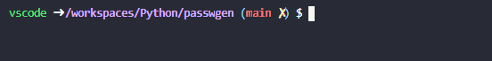

# passwgen

A simple CLI password generator program that can generate passwords with specifed length and chosen types of charachers(lettters, digits, spaces and symbols).

For usage guide and documentation refer to: [Link to be inserted](#)

## Installation
Simply clone the repository and run the script.
``` bash
wget https://github.com/KlemenVovk/passwgen.git
cd passwgen
python3 passwgen.py LENGTH [SWITCH(ES)]
```
Replace LENGTH with your desired password length and optionally \[SWITCHES\] with your password characteristics as described in [CLI](#cli).
## CLI
A full CLI help page is shown with the -h switch.
```text
$ python3 passwgen.py -h
usage: passwgen.py [-h] [-c] [-C] [-d] [-w] [-s] length

A program for generating random passwords.

positional arguments:
  length            length of the password to generate

optional arguments:
  -h, --help        show this help message and exit
  -c, --lowercase   include lowercase letters in the generated password
  -C, --uppercase   include uppercase letters in the generated password
  -d, --digits      include digits in the generated password
  -w, --whitespace  include whitespace characters in the generated password
  -s, --symbols     include symbols in the generated password
```

*Note: -w will never generate consecutive whitespace or whitespace at the ends of the password. All characters are based on the standard ASCII table.*
## Demo

## Project goals
- [x] CLI
- [x] Length option
- [x] Symbols option
- [x] Numbers option
- [x] Lowercase option
- [x] Uppercase option
- [x] Space option
- [x] Documentation
- [x] API Reference
- [x] README
- [x] LICENSE
